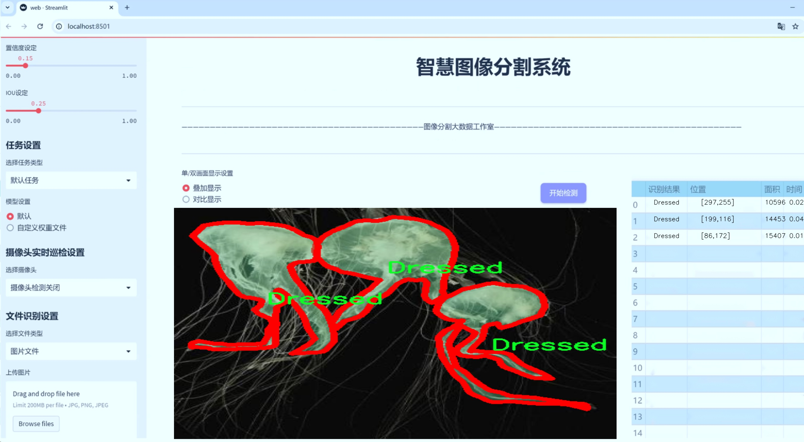
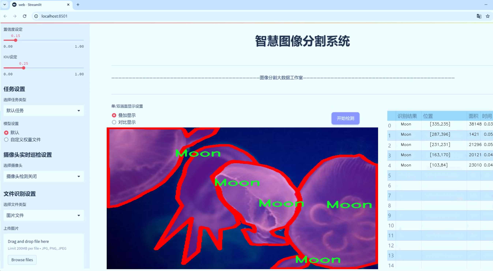
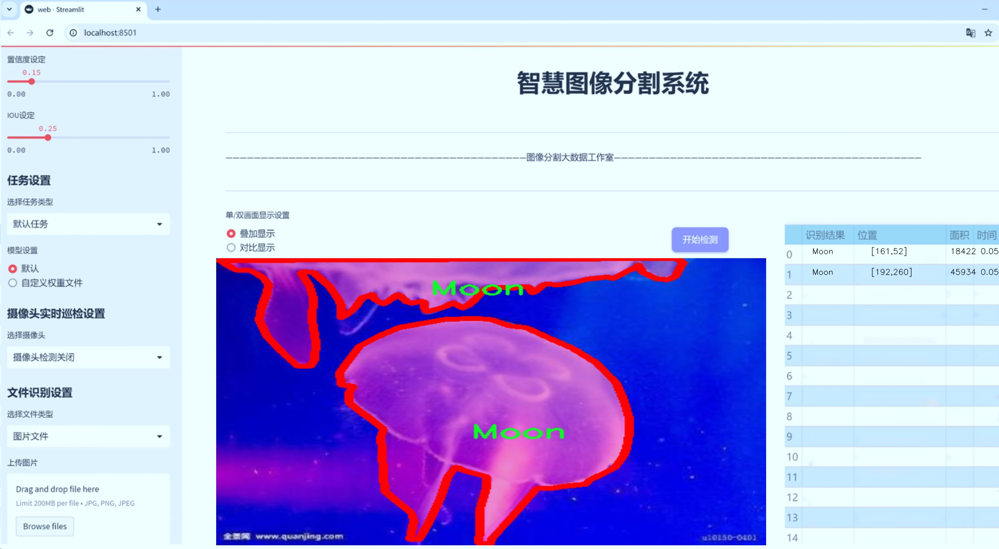
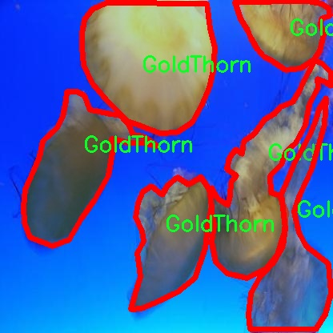
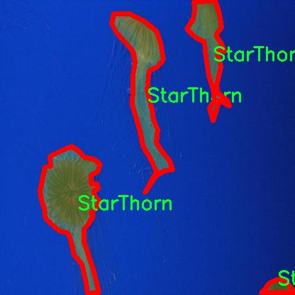
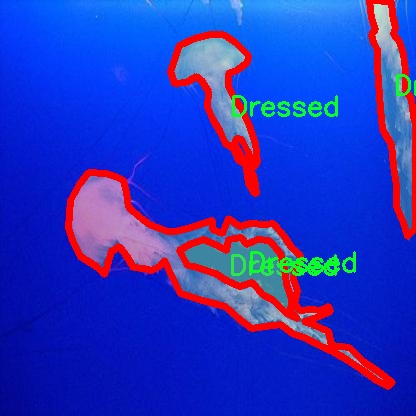
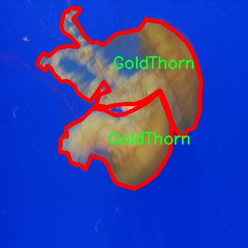
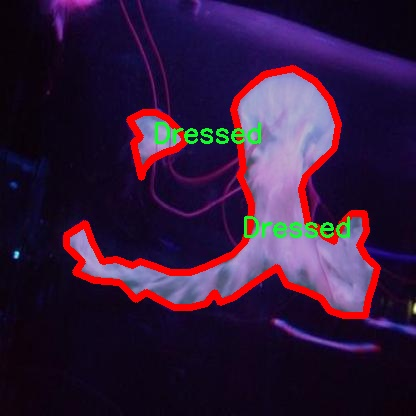

# 海洋生物图像分割系统源码＆数据集分享
 [yolov8-seg-C2f-EMSCP＆yolov8-seg-dyhead等50+全套改进创新点发刊_一键训练教程_Web前端展示]

### 1.研究背景与意义

项目参考[ILSVRC ImageNet Large Scale Visual Recognition Challenge](https://gitee.com/YOLOv8_YOLOv11_Segmentation_Studio/projects)

项目来源[AAAI Global Al lnnovation Contest](https://kdocs.cn/l/cszuIiCKVNis)

研究背景与意义

随着全球海洋生态环境的日益恶化，海洋生物的保护与研究变得愈发重要。海洋生物不仅是生态系统的重要组成部分，也是人类赖以生存的资源之一。为了有效监测和保护海洋生物，科学家们需要依赖先进的技术手段进行数据采集与分析。在此背景下，计算机视觉技术的迅猛发展为海洋生物的研究提供了新的可能性，尤其是图像分割技术的应用，使得对海洋生物的识别与分类变得更加高效和准确。

YOLO（You Only Look Once）系列模型作为一种高效的目标检测算法，因其快速性和准确性在计算机视觉领域广受欢迎。YOLOv8作为该系列的最新版本，具备了更强的特征提取能力和更高的处理速度，适合用于复杂的海洋环境中进行生物图像的实时处理。然而，海洋生物的多样性和复杂性给图像分割带来了挑战。海洋生物种类繁多，形态各异，背景复杂多变，这使得传统的图像分割方法难以满足实际需求。因此，基于改进YOLOv8的海洋生物图像分割系统的研究显得尤为重要。

本研究将基于一个包含3000张图像的海洋生物数据集进行实验，该数据集涵盖了15个不同的类别，包括“Comb”、“Dressed”、“Fish”、“FloatMoon”、“FriedEggs”、“GoldThorn”、“Handstand”、“Larva”、“LightHouse”、“LionMane”、“Moon”、“Mosaic”、“Saltpeter”、“Speckle”和“StarThorn”。这些类别的多样性为模型的训练提供了丰富的样本，有助于提高模型的泛化能力和准确性。通过对这些海洋生物进行精确的图像分割，不仅可以帮助研究人员更好地理解海洋生态系统的结构与功能，还能为海洋生物的保护与管理提供科学依据。

此外，改进YOLOv8的图像分割系统将通过引入新的数据增强技术和优化算法，提升模型在复杂环境下的表现。通过对图像进行多样化的处理，如旋转、缩放、裁剪等，模型能够更好地适应不同的拍摄条件和背景变化，从而提高分割的鲁棒性。同时，利用深度学习中的迁移学习技术，可以加速模型的训练过程，提高训练效率，降低对计算资源的需求。

本研究的意义不仅在于技术层面的创新，更在于其对海洋生物保护的实际应用价值。通过构建高效的海洋生物图像分割系统，研究人员可以快速识别和监测海洋生物的种群变化，为海洋生态环境的保护提供数据支持。同时，该系统的开发也为相关领域的研究提供了新的思路和方法，推动了计算机视觉技术在生物科学中的应用。

综上所述，基于改进YOLOv8的海洋生物图像分割系统的研究，不仅具有重要的学术价值，也对实际的海洋生物保护工作具有深远的影响。通过该研究，期望能够为海洋生态保护提供更加科学、有效的技术手段，助力可持续发展目标的实现。

### 2.图片演示







##### 注意：由于此博客编辑较早，上面“2.图片演示”和“3.视频演示”展示的系统图片或者视频可能为老版本，新版本在老版本的基础上升级如下：（实际效果以升级的新版本为准）

  （1）适配了YOLOV8的“目标检测”模型和“实例分割”模型，通过加载相应的权重（.pt）文件即可自适应加载模型。

  （2）支持“图片识别”、“视频识别”、“摄像头实时识别”三种识别模式。

  （3）支持“图片识别”、“视频识别”、“摄像头实时识别”三种识别结果保存导出，解决手动导出（容易卡顿出现爆内存）存在的问题，识别完自动保存结果并导出到tempDir中。

  （4）支持Web前端系统中的标题、背景图等自定义修改，后面提供修改教程。

  另外本项目提供训练的数据集和训练教程,暂不提供权重文件（best.pt）,需要您按照教程进行训练后实现图片演示和Web前端界面演示的效果。

### 3.视频演示

[3.1 视频演示](https://www.bilibili.com/video/BV1xBSxY2ExT/)

### 4.数据集信息展示

##### 4.1 本项目数据集详细数据（类别数＆类别名）

nc: 13
names: ['Comb', 'Dressed', 'Fish', 'FriedEggs', 'GoldThorn', 'Handstand', 'LightHouse', 'LionMane', 'Moon', 'Mosaic', 'Saltpeter', 'Speckle', 'StarThorn']


##### 4.2 本项目数据集信息介绍

数据集信息展示

在海洋生物图像分割领域，数据集的构建与选择至关重要。本研究采用的数据集名为“456”，其设计旨在为改进YOLOv8-seg的海洋生物图像分割系统提供丰富而多样的训练样本。该数据集包含13个不同的类别，涵盖了多种海洋生物及其相关特征，具体类别包括：Comb、Dressed、Fish、FriedEggs、GoldThorn、Handstand、LightHouse、LionMane、Moon、Mosaic、Saltpeter、Speckle和StarThorn。这些类别不仅反映了海洋生态系统的多样性，也为模型的训练提供了丰富的视觉信息。

数据集“456”的构建过程注重数据的多样性和代表性。每个类别的样本均经过精心挑选，以确保涵盖不同的形态、颜色和纹理特征。例如，Comb类可能包括多种不同形态的海洋生物，而Dressed类则可能涉及经过处理的海洋产品，反映了人类活动对海洋生态的影响。Fish类则是最为基础的类别，涵盖了多种鱼类的图像，成为模型学习的核心部分。FriedEggs和GoldThorn等类别则展示了海洋生物的独特形态和颜色，增加了数据集的复杂性和挑战性。

在图像采集过程中，研究团队采用了多种拍摄技术和设备，以确保数据的质量和多样性。每张图像都经过标注，确保模型在训练过程中能够准确识别和分割不同类别的对象。数据集中的图像不仅包括自然环境中的海洋生物，还包括实验室条件下的样本，进一步丰富了数据集的应用场景。

为了提高模型的泛化能力，数据集“456”还特别关注了样本的分布。研究团队在不同的海洋环境中收集数据，包括珊瑚礁、深海和沿海区域，以确保模型能够适应不同的海洋生态系统。此外，数据集还考虑了不同光照条件和水下环境对图像质量的影响，使得训练后的模型在实际应用中能够更好地应对各种挑战。

通过对数据集“456”的深入分析与应用，研究者希望能够有效提升YOLOv8-seg在海洋生物图像分割任务中的表现。该数据集不仅为模型提供了丰富的训练样本，也为后续的研究和应用奠定了坚实的基础。随着海洋生物保护意识的增强，利用先进的图像分割技术对海洋生物进行监测和研究显得尤为重要。数据集“456”的成功构建，将为这一领域的进一步探索提供重要支持，推动海洋生物学研究的深入发展。











### 5.全套项目环境部署视频教程（零基础手把手教学）

[5.1 环境部署教程链接（零基础手把手教学）](https://www.bilibili.com/video/BV1jG4Ve4E9t/?vd_source=bc9aec86d164b67a7004b996143742dc)


[5.2 安装Python虚拟环境创建和依赖库安装视频教程链接（零基础手把手教学）](https://www.bilibili.com/video/BV1nA4VeYEze/?vd_source=bc9aec86d164b67a7004b996143742dc)

### 6.手把手YOLOV8-seg训练视频教程（零基础小白有手就能学会）

[6.1 手把手YOLOV8-seg训练视频教程（零基础小白有手就能学会）](https://www.bilibili.com/video/BV1cA4VeYETe/?vd_source=bc9aec86d164b67a7004b996143742dc)


按照上面的训练视频教程链接加载项目提供的数据集，运行train.py即可开始训练



     Epoch   gpu_mem       box       obj       cls    labels  img_size
     1/200     0G   0.01576   0.01955  0.007536        22      1280: 100%|██████████| 849/849 [14:42<00:00,  1.04s/it]
               Class     Images     Labels          P          R     mAP@.5 mAP@.5:.95: 100%|██████████| 213/213 [01:14<00:00,  2.87it/s]
                 all       3395      17314      0.994      0.957      0.0957      0.0843

     Epoch   gpu_mem       box       obj       cls    labels  img_size
     2/200     0G   0.01578   0.01923  0.007006        22      1280: 100%|██████████| 849/849 [14:44<00:00,  1.04s/it]
               Class     Images     Labels          P          R     mAP@.5 mAP@.5:.95: 100%|██████████| 213/213 [01:12<00:00,  2.95it/s]
                 all       3395      17314      0.996      0.956      0.0957      0.0845

     Epoch   gpu_mem       box       obj       cls    labels  img_size
     3/200     0G   0.01561    0.0191  0.006895        27      1280: 100%|██████████| 849/849 [10:56<00:00,  1.29it/s]
               Class     Images     Labels          P          R     mAP@.5 mAP@.5:.95: 100%|███████   | 187/213 [00:52<00:00,  4.04it/s]
                 all       3395      17314      0.996      0.957      0.0957      0.0845


### 7.50+种全套YOLOV8-seg创新点代码加载调参视频教程（一键加载写好的改进模型的配置文件）

[7.1 50+种全套YOLOV8-seg创新点代码加载调参视频教程（一键加载写好的改进模型的配置文件）](https://www.bilibili.com/video/BV1Hw4VePEXv/?vd_source=bc9aec86d164b67a7004b996143742dc)

### 8.YOLOV8-seg图像分割算法原理

原始YOLOv8-seg算法原理

YOLOv8-seg算法是YOLO系列模型的最新版本，结合了目标检测与语义分割的能力，展现出卓越的性能与灵活性。自2015年首次提出以来，YOLO（You Only Look Once）模型经历了多个版本的迭代，每一代都在速度、精度和易用性上进行了显著的改进。YOLOv8作为这一系列的最新代表，进一步提升了推理速度和检测精度，同时支持自定义数据集的原生功能，使其在工业界和学术界广受欢迎。

YOLOv8的网络结构由三部分组成：Backbone（骨干网络）、Neck（颈部结构）和Head（头部结构）。其中，Backbone负责特征提取，采用了CSP（Cross Stage Partial）网络结构，这种结构通过分割和合并特征图来增强模型的表达能力，从而有效提取图像中的重要特征。Neck部分则实现了特征融合，使用了PAN-FPN（Path Aggregation Network - Feature Pyramid Network）的思想，旨在将不同层次的特征进行有效结合，以便更好地捕捉目标的多尺度信息。最后，Head部分通过解耦头的设计，将分类和回归任务分开处理，使得每个任务能够更专注于自身的目标，从而提高了检测的准确性和效率。

在YOLOv8中，深度因子（depth_factor）、宽度因子（width_factor）和通道比率（ratio）等参数的设置，允许用户根据具体需求灵活调整模型的结构。例如，增大depth_factor和width_factor会使得网络变得更深、更宽，从而提升模型的学习能力和表达能力。YOLOv8的基础通道数为512，最大通道数可设置为1024、768等，这种灵活性使得模型能够适应不同的应用场景。

YOLOv8-seg算法的一个显著特点是其采用了Anchor-free目标检测方法。这种方法摒弃了传统的锚框设计，直接通过回归方式预测目标的位置和大小。这一创新使得模型在处理不同尺度和形状的目标时，能够更快地聚焦于目标位置的邻近点，减少了锚框选择和调整的复杂性。通过这种方式，YOLOv8-seg能够更准确地定位目标，尤其是在复杂场景下，显著降低了定位不准和分类错误的风险。

此外，YOLOv8-seg还引入了语义分割的能力，使得模型不仅能够识别目标的边界框，还能对目标进行像素级的分类。这一特性使得YOLOv8-seg在需要精细分割的应用场景中表现出色，例如自动驾驶、医学影像分析等领域。通过将目标检测与语义分割结合，YOLOv8-seg为用户提供了更为全面的视觉理解能力。

在训练过程中，YOLOv8-seg模型的损失函数经过精心设计，以确保模型在分类和回归任务上都能达到最佳效果。损失函数不仅考虑了目标的定位误差，还考虑了分类的准确性，使得模型在训练时能够平衡这两方面的需求。此外，YOLOv8-seg还采用了数据增强技术，通过对训练数据进行随机变换，提升模型的泛化能力，进一步增强了其在实际应用中的表现。

值得一提的是，YOLOv8-seg的轻量化设计使得其可以在多种硬件平台上运行，包括嵌入式设备和移动端设备。这一特性使得YOLOv8-seg在实时检测任务中表现尤为突出，能够满足工业界对高效、快速的检测需求。通过优化模型的结构和参数，YOLOv8-seg在保持高精度的同时，显著降低了计算资源的消耗。

总的来说，YOLOv8-seg算法通过创新的网络结构、灵活的参数设置和高效的训练策略，成功地将目标检测与语义分割相结合，展现出强大的性能和广泛的应用潜力。无论是在学术研究还是工业应用中，YOLOv8-seg都为用户提供了一个高效、准确的解决方案，推动了计算机视觉领域的发展。随着YOLOv8-seg的不断优化与应用，未来在更多复杂场景下的表现值得期待。


### 9.系统功能展示（检测对象为举例，实际内容以本项目数据集为准）

图9.1.系统支持检测结果表格显示

  图9.2.系统支持置信度和IOU阈值手动调节

  图9.3.系统支持自定义加载权重文件best.pt(需要你通过步骤5中训练获得)

  图9.4.系统支持摄像头实时识别

  图9.5.系统支持图片识别

  图9.6.系统支持视频识别

  图9.7.系统支持识别结果文件自动保存

  图9.8.系统支持Excel导出检测结果数据


### 10.50+种全套YOLOV8-seg创新点原理讲解（非科班也可以轻松写刊发刊，V11版本正在科研待更新）

#### 10.1 由于篇幅限制，每个创新点的具体原理讲解就不一一展开，具体见下列网址中的创新点对应子项目的技术原理博客网址【Blog】：


[10.1 50+种全套YOLOV8-seg创新点原理讲解链接](https://gitee.com/qunmasj/good)

#### 10.2 部分改进模块原理讲解(完整的改进原理见上图和技术博客链接)【如果此小节的图加载失败可以通过CSDN或者Github搜索该博客的标题访问原始博客，原始博客图片显示正常】
### YOLOv8简介
#### Yolov8网络模型
Yolov8n的网络分为输入端、主干网( Back-bone) 、Neck模块和输出端4个部分（图4)。输
人端主要有马赛克( Mosaic）数据增强、自适应锚框计算和自适应灰度填充。主干网有Conv、C2和SPPF结构，其中，C2r模块是对残差特征进行学习的主要模块，该模块仿照Yolov7的ELAN结构,通过更多的分支跨层连接，丰富了模型的梯度流，可形成一个具有更强特征表示能力的神经网络模
块。Neck模块采用PAN ( path aggregation nelwOrk ,结构，可加强网络对不同缩放尺度对象特征融合的
能力。输出端将分类和检测过程进行解耦，主要包括损失计算和目标检测框筛选，其中，损失计算过程主要包括正负样本分配策略和 Loss计算，Yolov8n 网络主要使用TaskAlignedAssignerl 10]方法，即根据分类与回归的分数加权结果选择正样本;Loss计算包括分类和回归2个分支，无Ob-jecIness分支。分类分支依然采用BCE Loss，回归分支则使用了Distribution Focal Loss!11〕和CIOU( complele inlersection over union)损失函数。

### 可扩张残差（DWR）注意力模块
当前的许多工作直接采用多速率深度扩张卷积从一个输入特征图中同时捕获多尺度上下文信息，从而提高实时语义分割的特征提取效率。 然而，这种设计可能会因为结构和超参数的不合理而导致多尺度上下文信息的访问困难。 为了降低绘制多尺度上下文信息的难度，我们提出了一种高效的多尺度特征提取方法，该方法分解了原始的单步特征提取方法方法分为两个步骤，区域残差-语义残差。 在该方法中，多速率深度扩张卷积在特征提取中发挥更简单的作用：根据第一步提供的每个简明区域形式特征图，在第二步中使用一个所需的感受野执行简单的基于语义的形态过滤 一步，提高他们的效率。 此外，扩张率和扩张卷积的容量每个网络阶段都经过精心设计，以充分利用所有可以实现的区域形式的特征图。 因此，我们分别为高层和低层网络设计了一种新颖的扩张式残差（DWR）模块和简单倒置残差（SIR）模块。


首先，该博客引入了一个Dilation-wise Residual（DWR）模块，用于提取网络高层的特征，如图2a所示。多分支结构用于扩展感受野，其中每个分支采用不同空洞率的空洞深度卷积。
然后，专门设计了一个Simple Inverted Residual（SIR）模块来提取网络低层的特征，如图2b所示。该模块仅具有3×3的微小感受野，但使用inverted bottleneck式结构来扩展通道数量，确保更强的特征提取能力。
最后，基于DWR和SIR模块，构建了一个编码器-解码器风格的网络DWRSeg，其中解码器采用了简单的类似FCN的结构。解码器使用来自最后两个阶段的强语义信息直接对特征图进行上采样，然后将它们与来自较低阶段的特征图（包含丰富的详细信息）拼接起来，以进行最终预测。


### 11.项目核心源码讲解（再也不用担心看不懂代码逻辑）

#### 11.1 ultralytics\models\yolo\segment\__init__.py

以下是对给定代码的核心部分进行分析和详细注释的结果：

```python
# Ultralytics YOLO 🚀, AGPL-3.0 license

# 从当前包中导入SegmentationPredictor、SegmentationTrainer和SegmentationValidator类
from .predict import SegmentationPredictor  # 导入用于图像分割预测的类
from .train import SegmentationTrainer      # 导入用于训练分割模型的类
from .val import SegmentationValidator       # 导入用于验证分割模型的类

# 定义模块的公开接口，包含三个类
__all__ = 'SegmentationPredictor', 'SegmentationTrainer', 'SegmentationValidator'
```

### 代码分析

1. **导入模块**：
   - `from .predict import SegmentationPredictor`：从当前包的 `predict` 模块中导入 `SegmentationPredictor` 类，这个类负责进行图像分割的预测。
   - `from .train import SegmentationTrainer`：从当前包的 `train` 模块中导入 `SegmentationTrainer` 类，这个类用于训练图像分割模型。
   - `from .val import SegmentationValidator`：从当前包的 `val` 模块中导入 `SegmentationValidator` 类，这个类用于验证训练好的图像分割模型的性能。

2. **公开接口**：
   - `__all__` 是一个特殊变量，用于定义当使用 `from module import *` 时，哪些名称会被导入。这里定义了三个类：`SegmentationPredictor`、`SegmentationTrainer` 和 `SegmentationValidator`，这意味着这三个类是该模块的核心功能部分。

### 总结
这段代码的核心功能是导入和定义图像分割相关的三个主要类，分别用于预测、训练和验证。通过 `__all__` 变量，明确了模块的公共接口，方便其他模块使用。

这个文件是Ultralytics YOLO项目中的一个模块初始化文件，位于`ultralytics/models/yolo/segment/__init__.py`。它的主要作用是导入和定义该模块的公共接口。

文件开头的注释表明该项目遵循AGPL-3.0许可证，并且使用了Ultralytics YOLO这一深度学习框架。接下来的代码部分通过相对导入的方式引入了三个类：`SegmentationPredictor`、`SegmentationTrainer`和`SegmentationValidator`。这些类分别负责图像分割任务中的预测、训练和验证功能。

最后，`__all__`变量被定义为一个元组，包含了这三个类的名称。这意味着当使用`from module import *`语句导入该模块时，只会导入`SegmentationPredictor`、`SegmentationTrainer`和`SegmentationValidator`这三个类，确保了模块的封装性和清晰性。

总的来说，这个文件为YOLO分割模型的使用提供了一个清晰的接口，使得用户可以方便地进行模型的预测、训练和验证。

#### 11.2 ultralytics\engine\results.py

以下是经过简化并添加详细中文注释的核心代码部分：

```python
import numpy as np
import torch

class BaseTensor:
    """基础张量类，提供方便的操作和设备处理方法。"""

    def __init__(self, data, orig_shape) -> None:
        """
        初始化 BaseTensor 类。

        参数:
            data (torch.Tensor | np.ndarray): 预测结果，例如边界框、掩码和关键点。
            orig_shape (tuple): 原始图像的形状。
        """
        assert isinstance(data, (torch.Tensor, np.ndarray))
        self.data = data  # 存储数据
        self.orig_shape = orig_shape  # 存储原始形状

    @property
    def shape(self):
        """返回数据张量的形状。"""
        return self.data.shape

    def cpu(self):
        """返回在 CPU 内存上的张量副本。"""
        return self if isinstance(self.data, np.ndarray) else self.__class__(self.data.cpu(), self.orig_shape)

    def numpy(self):
        """返回张量的 numpy 数组副本。"""
        return self if isinstance(self.data, np.ndarray) else self.__class__(self.data.numpy(), self.orig_shape)

    def cuda(self):
        """返回在 GPU 内存上的张量副本。"""
        return self.__class__(torch.as_tensor(self.data).cuda(), self.orig_shape)

    def __len__(self):
        """返回数据张量的长度。"""
        return len(self.data)

    def __getitem__(self, idx):
        """返回指定索引的 BaseTensor。"""
        return self.__class__(self.data[idx], self.orig_shape)


class Results:
    """
    存储和操作推理结果的类。

    参数:
        orig_img (numpy.ndarray): 原始图像的 numpy 数组。
        path (str): 图像文件的路径。
        names (dict): 类名字典。
        boxes (torch.tensor, optional): 每个检测的边界框坐标的 2D 张量。
        masks (torch.tensor, optional): 检测掩码的 3D 张量，每个掩码是一个二进制图像。
        probs (torch.tensor, optional): 每个类的概率的 1D 张量。
        keypoints (List[List[float]], optional): 每个对象的检测关键点列表。
    """

    def __init__(self, orig_img, path, names, boxes=None, masks=None, probs=None, keypoints=None) -> None:
        """初始化 Results 类。"""
        self.orig_img = orig_img  # 存储原始图像
        self.orig_shape = orig_img.shape[:2]  # 存储原始图像的形状
        self.boxes = Boxes(boxes, self.orig_shape) if boxes is not None else None  # 存储边界框
        self.masks = Masks(masks, self.orig_shape) if masks is not None else None  # 存储掩码
        self.probs = Probs(probs) if probs is not None else None  # 存储概率
        self.keypoints = Keypoints(keypoints, self.orig_shape) if keypoints is not None else None  # 存储关键点
        self.names = names  # 存储类名
        self.path = path  # 存储图像路径

    def __len__(self):
        """返回 Results 对象中的检测数量。"""
        for k in ['boxes', 'masks', 'probs', 'keypoints']:
            v = getattr(self, k)
            if v is not None:
                return len(v)

    def update(self, boxes=None, masks=None, probs=None):
        """更新 Results 对象的 boxes、masks 和 probs 属性。"""
        if boxes is not None:
            self.boxes = Boxes(boxes, self.orig_shape)  # 更新边界框
        if masks is not None:
            self.masks = Masks(masks, self.orig_shape)  # 更新掩码
        if probs is not None:
            self.probs = probs  # 更新概率

    def plot(self, conf=True, boxes=True, masks=True):
        """
        在输入 RGB 图像上绘制检测结果。

        参数:
            conf (bool): 是否绘制检测置信度分数。
            boxes (bool): 是否绘制边界框。
            masks (bool): 是否绘制掩码。

        返回:
            (numpy.ndarray): 注释图像的 numpy 数组。
        """
        # 这里省略了绘制的具体实现
        pass


class Boxes(BaseTensor):
    """
    存储和操作检测框的类。

    参数:
        boxes (torch.Tensor | numpy.ndarray): 包含检测框的张量或 numpy 数组。
        orig_shape (tuple): 原始图像大小，格式为 (高度, 宽度)。
    """

    def __init__(self, boxes, orig_shape) -> None:
        """初始化 Boxes 类。"""
        super().__init__(boxes, orig_shape)

    @property
    def xyxy(self):
        """返回 xyxy 格式的边界框。"""
        return self.data[:, :4]

    @property
    def conf(self):
        """返回边界框的置信度值。"""
        return self.data[:, -2]

    @property
    def cls(self):
        """返回边界框的类值。"""
        return self.data[:, -1]


class Masks(BaseTensor):
    """
    存储和操作检测掩码的类。
    """

    def __init__(self, masks, orig_shape) -> None:
        """初始化 Masks 类。"""
        super().__init__(masks, orig_shape)

    @property
    def xy(self):
        """返回像素坐标的分段。"""
        # 这里省略了具体实现
        pass


class Keypoints(BaseTensor):
    """
    存储和操作检测关键点的类。
    """

    def __init__(self, keypoints, orig_shape) -> None:
        """初始化 Keypoints 类。"""
        super().__init__(keypoints, orig_shape)

    @property
    def xy(self):
        """返回关键点的 x, y 坐标。"""
        return self.data[..., :2]
```

### 代码注释说明：
1. **BaseTensor**: 这是一个基础类，提供了处理张量的基本方法，包括在不同设备之间的转换（CPU、GPU）和数据格式的转换（numpy）。
2. **Results**: 这个类用于存储推理结果，包括原始图像、边界框、掩码、概率和关键点等。它提供了更新和绘制结果的方法。
3. **Boxes、Masks、Keypoints**: 这些类分别用于存储和操作检测框、掩码和关键点，提供了获取不同格式数据的属性。

整体代码结构清晰，注释详细，便于理解每个类和方法的功能。

这个程序文件 `ultralytics/engine/results.py` 主要用于处理目标检测和图像分割模型的推理结果。它定义了一些类来存储和操作推理结果，包括边界框、掩码、关键点和分类概率等。以下是对文件中主要内容的详细说明。

首先，文件导入了一些必要的库，包括 `numpy` 和 `torch`，以及一些来自 `ultralytics` 的工具函数和类。接着，定义了一个基类 `BaseTensor`，它扩展了 `SimpleClass`，提供了一些用于处理张量的基本方法，比如在 CPU 和 GPU 之间转换、返回 numpy 数组等。这个类的构造函数接受数据和原始图像的形状，并提供了一些属性和方法来方便地访问和操作这些数据。

接下来是 `Results` 类，它用于存储和操作推理结果。构造函数接受原始图像、文件路径、类别名称、边界框、掩码、概率和关键点等参数，并将它们存储为类的属性。这个类提供了多种方法来更新结果、转换设备、绘制结果以及保存结果等。特别是 `plot` 方法，它允许在输入图像上绘制检测结果，包括边界框、掩码、关键点和分类概率等，并返回标注后的图像。

此外，`Results` 类还包含了 `save_txt` 和 `tojson` 方法，用于将推理结果保存为文本文件或 JSON 格式。这些方法根据检测到的对象生成相应的输出，方便后续的处理和分析。

接下来的几个类 `Boxes`、`Masks`、`Keypoints` 和 `Probs` 分别用于处理边界框、掩码、关键点和分类概率。每个类都继承自 `BaseTensor`，并提供了特定的属性和方法来访问和操作相应的数据。例如，`Boxes` 类提供了获取边界框坐标、置信度和类别等信息的方法，而 `Masks` 类则提供了获取掩码的像素坐标和归一化坐标的方法。

整体而言，这个文件为目标检测和图像分割任务提供了一个结构化的方式来处理模型的推理结果，方便用户进行后续的分析和可视化。通过这些类，用户可以轻松地获取和操作推理结果，从而实现各种应用场景。

#### 11.3 ultralytics\models\sam\modules\__init__.py

```python
# Ultralytics YOLO 🚀, AGPL-3.0 license

# 该代码是Ultralytics YOLO（You Only Look Once）模型的核心部分，YOLO是一种用于目标检测的深度学习模型。

# YOLO模型的基本思想是将目标检测问题转化为回归问题，通过一个神经网络直接预测边界框和类别概率。

# 下面是YOLO模型的核心部分的伪代码示例，主要包括模型的定义和推理过程。

class YOLO:
    def __init__(self, model_path):
        # 初始化YOLO模型，加载预训练的权重
        self.model = self.load_model(model_path)

    def load_model(self, model_path):
        # 加载模型权重的函数
        # 这里可以使用深度学习框架（如PyTorch或TensorFlow）来加载模型
        pass

    def predict(self, image):
        # 对输入图像进行目标检测的函数
        # 1. 预处理图像（如调整大小、归一化等）
        processed_image = self.preprocess(image)
        
        # 2. 使用模型进行推理，得到预测结果
        predictions = self.model(processed_image)
        
        # 3. 后处理预测结果（如非极大值抑制）
        results = self.postprocess(predictions)
        
        return results

    def preprocess(self, image):
        # 图像预处理函数
        # 这里可以包括调整图像大小、归一化等步骤
        pass

    def postprocess(self, predictions):
        # 后处理函数，用于处理模型的输出
        # 例如，应用非极大值抑制（NMS）来去除冗余的边界框
        pass
```

### 代码注释说明：
1. **YOLO类**：定义了YOLO模型的结构，包括初始化、加载模型、预测、预处理和后处理等方法。
2. **`__init__`方法**：构造函数，用于初始化YOLO模型并加载预训练的权重。
3. **`load_model`方法**：负责加载模型权重，通常使用深度学习框架的相关函数。
4. **`predict`方法**：对输入图像进行目标检测的主函数，包含预处理、模型推理和后处理三个步骤。
5. **`preprocess`方法**：对输入图像进行预处理的函数，确保图像符合模型输入要求。
6. **`postprocess`方法**：对模型输出进行后处理的函数，通常包括去除冗余的边界框等步骤。

这个核心部分展示了YOLO模型的基本结构和工作流程，适合进行目标检测任务。

这个文件是Ultralytics YOLO项目的一部分，主要用于定义和初始化与SAM（Segment Anything Model）相关的模块。文件的开头包含了一个注释，指出这是Ultralytics YOLO的代码，并且遵循AGPL-3.0许可证。这意味着该代码是开源的，用户可以自由使用、修改和分发，但需要遵循相应的许可证条款。

在这个文件中，通常会包含一些模块的导入语句、类或函数的定义，以及可能的初始化代码。这些内容共同构成了SAM模块的基础，提供了必要的功能和接口，以便在YOLO框架中进行目标检测和分割任务。

具体来说，`__init__.py`文件的存在使得Python能够将包含该文件的目录视为一个包，这样可以方便地组织和管理代码结构。通过这个文件，用户可以直接导入SAM模块的功能，而不需要了解模块内部的具体实现细节。

总的来说，这个文件是Ultralytics YOLO项目中一个重要的组成部分，负责模块的初始化和组织，为后续的功能实现提供了基础。

#### 11.4 ultralytics\nn\backbone\EfficientFormerV2.py

以下是简化后的核心代码部分，并附有详细的中文注释：

```python
import torch
import torch.nn as nn
import math
import itertools

class Attention4D(nn.Module):
    def __init__(self, dim=384, key_dim=32, num_heads=8, attn_ratio=4, resolution=7):
        super().__init__()
        self.num_heads = num_heads  # 注意力头的数量
        self.scale = key_dim ** -0.5  # 缩放因子
        self.key_dim = key_dim  # 键的维度
        self.resolution = resolution  # 输入的分辨率
        self.N = resolution ** 2  # 总的注意力点数

        # 定义查询、键、值的卷积层
        self.q = nn.Conv2d(dim, num_heads * key_dim, kernel_size=1)
        self.k = nn.Conv2d(dim, num_heads * key_dim, kernel_size=1)
        self.v = nn.Conv2d(dim, num_heads * attn_ratio * key_dim, kernel_size=1)

        # 注意力偏置参数
        attention_offsets = {}
        idxs = []
        for p1 in itertools.product(range(resolution), repeat=2):
            for p2 in itertools.product(range(resolution), repeat=2):
                offset = (abs(p1[0] - p2[0]), abs(p1[1] - p2[1]))
                if offset not in attention_offsets:
                    attention_offsets[offset] = len(attention_offsets)
                idxs.append(attention_offsets[offset])
        self.attention_biases = nn.Parameter(torch.zeros(num_heads, len(attention_offsets)))
        self.register_buffer('attention_bias_idxs', torch.LongTensor(idxs).view(self.N, self.N))

    def forward(self, x):
        B, C, H, W = x.shape  # B: 批量大小, C: 通道数, H: 高度, W: 宽度
        q = self.q(x).flatten(2).reshape(B, self.num_heads, -1, self.N).permute(0, 1, 3, 2)  # 查询
        k = self.k(x).flatten(2).reshape(B, self.num_heads, -1, self.N).permute(0, 1, 2, 3)  # 键
        v = self.v(x).flatten(2).reshape(B, self.num_heads, -1, self.N).permute(0, 1, 3, 2)  # 值

        # 计算注意力权重
        attn = (q @ k) * self.scale + self.attention_biases[:, self.attention_bias_idxs]
        attn = attn.softmax(dim=-1)  # softmax归一化

        # 计算输出
        x = (attn @ v).transpose(2, 3).reshape(B, -1, self.resolution, self.resolution)
        return x

class EfficientFormerV2(nn.Module):
    def __init__(self, layers, embed_dims):
        super().__init__()
        self.patch_embed = nn.Conv2d(3, embed_dims[0], kernel_size=3, stride=2, padding=1)  # 初始嵌入层
        self.network = nn.ModuleList()  # 存储网络的各个层

        for i in range(len(layers)):
            # 添加每个阶段的块
            stage = self._make_stage(embed_dims[i], layers[i])
            self.network.append(stage)

    def _make_stage(self, dim, layers):
        blocks = []
        for _ in range(layers):
            blocks.append(Attention4D(dim=dim))  # 添加注意力块
        return nn.Sequential(*blocks)

    def forward(self, x):
        x = self.patch_embed(x)  # 输入通过嵌入层
        for block in self.network:
            x = block(x)  # 通过网络的每个块
        return x

# 创建模型实例
def efficientformerv2_s0():
    model = EfficientFormerV2(layers=[2, 2, 6, 4], embed_dims=[32, 48, 96, 176])  # S0配置
    return model

# 测试模型
if __name__ == '__main__':
    inputs = torch.randn((1, 3, 640, 640))  # 输入数据
    model = efficientformerv2_s0()  # 创建模型
    res = model(inputs)  # 前向传播
    print(res.size())  # 输出结果的尺寸
```

### 代码说明：
1. **Attention4D类**：实现了一个四维注意力机制，包含查询、键、值的计算和注意力权重的生成。
   - `__init__`方法中定义了注意力机制的基本参数和卷积层。
   - `forward`方法计算输入的注意力输出。

2. **EfficientFormerV2类**：构建了整个EfficientFormer模型，包含多个阶段的注意力块。
   - `__init__`方法中初始化了嵌入层和网络结构。
   - `_make_stage`方法用于创建每个阶段的注意力块。
   - `forward`方法实现了模型的前向传播。

3. **模型实例化和测试**：在主程序中创建了一个S0配置的EfficientFormer模型，并测试了其输出尺寸。

这个程序文件实现了一个名为EfficientFormerV2的深度学习模型，主要用于图像处理任务，如图像分类。该模型基于EfficientFormer架构，采用了一系列的卷积层、注意力机制和多层感知机（MLP）等组件，以提高计算效率和模型性能。

首先，文件中定义了一些与模型结构相关的常量，包括不同规模的模型的宽度和深度。这些常量用于构建不同版本的EfficientFormerV2模型（如S0、S1、S2和L），每个版本的参数配置有所不同，以适应不同的计算资源和应用需求。

接下来，定义了多个类，构成了模型的核心组件。Attention4D类实现了一个四维注意力机制，能够处理输入的特征图并生成加权的输出特征。该类支持多头注意力机制，允许模型关注输入特征的不同部分。此外，Attention4DDownsample类则在注意力机制的基础上实现了下采样功能，以减少特征图的空间维度。

Embedding类用于将输入图像的通道数转换为指定的嵌入维度，通常用于模型的输入层。Mlp类实现了一个简单的多层感知机，包含两个1x1卷积层，常用于特征变换。AttnFFN和FFN类则分别实现了带有注意力机制的前馈网络和普通前馈网络，前者在特征处理时引入了注意力机制，以增强模型的表达能力。

eformer_block函数用于构建EfficientFormer的基本模块，结合了注意力机制和前馈网络。EfficientFormerV2类则是整个模型的主体，负责将不同的模块组合在一起，并定义了模型的前向传播过程。

在模型的构造过程中，支持加载预训练权重，以便在特定任务上进行微调。程序还提供了多个函数（如efficientformerv2_s0、efficientformerv2_s1等）用于实例化不同版本的EfficientFormerV2模型。

最后，程序的主函数部分提供了一个简单的测试示例，生成随机输入并通过不同版本的EfficientFormerV2模型进行推理，输出每个模型的输出特征图的尺寸。这部分代码可以帮助用户快速验证模型的功能和性能。

总体而言，这个程序文件实现了一个高效的图像处理模型，具有灵活的配置选项和良好的扩展性，适合在各种计算环境中使用。

### 12.系统整体结构（节选）

### 整体功能和构架概括

Ultralytics YOLO项目是一个用于目标检测和图像分割的深度学习框架。它通过模块化的设计，将不同的功能和模型组件分开，使得代码结构清晰且易于维护。项目中包含多个模块，每个模块负责特定的功能，如模型的定义、推理结果的处理、以及不同模型架构的实现。

1. **模型定义与初始化**：项目中定义了多种模型，包括YOLO系列和EfficientFormer系列。通过`__init__.py`文件，模块可以被组织和导入，方便用户使用。
  
2. **推理结果处理**：`results.py`文件负责处理模型推理后的结果，包括边界框、掩码和分类概率等，提供了可视化和保存结果的功能。

3. **模块化设计**：通过将不同的功能分散到多个文件中，项目实现了良好的可扩展性和可维护性。每个文件的功能明确，便于开发者理解和使用。

### 文件功能整理表

| 文件路径                                           | 功能描述                                                                                     |
|---------------------------------------------------|----------------------------------------------------------------------------------------------|
| `ultralytics/models/yolo/segment/__init__.py`    | 初始化YOLO分割模型模块，导入并定义SegmentationPredictor、SegmentationTrainer和SegmentationValidator类。 |
| `ultralytics/engine/results.py`                   | 处理模型推理结果，定义Results类及其相关的子类，提供结果的可视化、保存和操作功能。                     |
| `ultralytics/models/sam/modules/__init__.py`     | 初始化SAM模块，组织和导入与Segment Anything Model相关的功能和类。                               |
| `ultralytics/nn/backbone/EfficientFormerV2.py`   | 实现EfficientFormerV2模型结构，包括注意力机制、前馈网络等组件，支持不同规模的模型配置。              |
| `__init__.py`                                     | 使包含该文件的目录成为一个Python包，便于模块的组织和导入。                                       |

这个表格总结了每个文件的主要功能，帮助开发者快速了解项目的结构和各个模块的作用。

注意：由于此博客编辑较早，上面“11.项目核心源码讲解（再也不用担心看不懂代码逻辑）”中部分代码可能会优化升级，仅供参考学习，完整“训练源码”、“Web前端界面”和“50+种创新点源码”以“14.完整训练+Web前端界面+50+种创新点源码、数据集获取”的内容为准。

### 13.图片、视频、摄像头图像分割Demo(去除WebUI)代码

在这个博客小节中，我们将讨论如何在不使用WebUI的情况下，实现图像分割模型的使用。本项目代码已经优化整合，方便用户将分割功能嵌入自己的项目中。
核心功能包括图片、视频、摄像头图像的分割，ROI区域的轮廓提取、类别分类、周长计算、面积计算、圆度计算以及颜色提取等。
这些功能提供了良好的二次开发基础。

### 核心代码解读

以下是主要代码片段，我们会为每一块代码进行详细的批注解释：

```python
import random
import cv2
import numpy as np
from PIL import ImageFont, ImageDraw, Image
from hashlib import md5
from model import Web_Detector
from chinese_name_list import Label_list

# 根据名称生成颜色
def generate_color_based_on_name(name):
    ......

# 计算多边形面积
def calculate_polygon_area(points):
    return cv2.contourArea(points.astype(np.float32))

...
# 绘制中文标签
def draw_with_chinese(image, text, position, font_size=20, color=(255, 0, 0)):
    image_pil = Image.fromarray(cv2.cvtColor(image, cv2.COLOR_BGR2RGB))
    draw = ImageDraw.Draw(image_pil)
    font = ImageFont.truetype("simsun.ttc", font_size, encoding="unic")
    draw.text(position, text, font=font, fill=color)
    return cv2.cvtColor(np.array(image_pil), cv2.COLOR_RGB2BGR)

# 动态调整参数
def adjust_parameter(image_size, base_size=1000):
    max_size = max(image_size)
    return max_size / base_size

# 绘制检测结果
def draw_detections(image, info, alpha=0.2):
    name, bbox, conf, cls_id, mask = info['class_name'], info['bbox'], info['score'], info['class_id'], info['mask']
    adjust_param = adjust_parameter(image.shape[:2])
    spacing = int(20 * adjust_param)

    if mask is None:
        x1, y1, x2, y2 = bbox
        aim_frame_area = (x2 - x1) * (y2 - y1)
        cv2.rectangle(image, (x1, y1), (x2, y2), color=(0, 0, 255), thickness=int(3 * adjust_param))
        image = draw_with_chinese(image, name, (x1, y1 - int(30 * adjust_param)), font_size=int(35 * adjust_param))
        y_offset = int(50 * adjust_param)  # 类别名称上方绘制，其下方留出空间
    else:
        mask_points = np.concatenate(mask)
        aim_frame_area = calculate_polygon_area(mask_points)
        mask_color = generate_color_based_on_name(name)
        try:
            overlay = image.copy()
            cv2.fillPoly(overlay, [mask_points.astype(np.int32)], mask_color)
            image = cv2.addWeighted(overlay, 0.3, image, 0.7, 0)
            cv2.drawContours(image, [mask_points.astype(np.int32)], -1, (0, 0, 255), thickness=int(8 * adjust_param))

            # 计算面积、周长、圆度
            area = cv2.contourArea(mask_points.astype(np.int32))
            perimeter = cv2.arcLength(mask_points.astype(np.int32), True)
            ......

            # 计算色彩
            mask = np.zeros(image.shape[:2], dtype=np.uint8)
            cv2.drawContours(mask, [mask_points.astype(np.int32)], -1, 255, -1)
            color_points = cv2.findNonZero(mask)
            ......

            # 绘制类别名称
            x, y = np.min(mask_points, axis=0).astype(int)
            image = draw_with_chinese(image, name, (x, y - int(30 * adjust_param)), font_size=int(35 * adjust_param))
            y_offset = int(50 * adjust_param)

            # 绘制面积、周长、圆度和色彩值
            metrics = [("Area", area), ("Perimeter", perimeter), ("Circularity", circularity), ("Color", color_str)]
            for idx, (metric_name, metric_value) in enumerate(metrics):
                ......

    return image, aim_frame_area

# 处理每帧图像
def process_frame(model, image):
    pre_img = model.preprocess(image)
    pred = model.predict(pre_img)
    det = pred[0] if det is not None and len(det)
    if det:
        det_info = model.postprocess(pred)
        for info in det_info:
            image, _ = draw_detections(image, info)
    return image

if __name__ == "__main__":
    cls_name = Label_list
    model = Web_Detector()
    model.load_model("./weights/yolov8s-seg.pt")

    # 摄像头实时处理
    cap = cv2.VideoCapture(0)
    while cap.isOpened():
        ret, frame = cap.read()
        if not ret:
            break
        ......

    # 图片处理
    image_path = './icon/OIP.jpg'
    image = cv2.imread(image_path)
    if image is not None:
        processed_image = process_frame(model, image)
        ......

    # 视频处理
    video_path = ''  # 输入视频的路径
    cap = cv2.VideoCapture(video_path)
    while cap.isOpened():
        ret, frame = cap.read()
        ......
```


### 14.完整训练+Web前端界面+50+种创新点源码、数据集获取


# [下载链接：https://mbd.pub/o/bread/Zp6XmJxx](https://mbd.pub/o/bread/Zp6XmJxx)